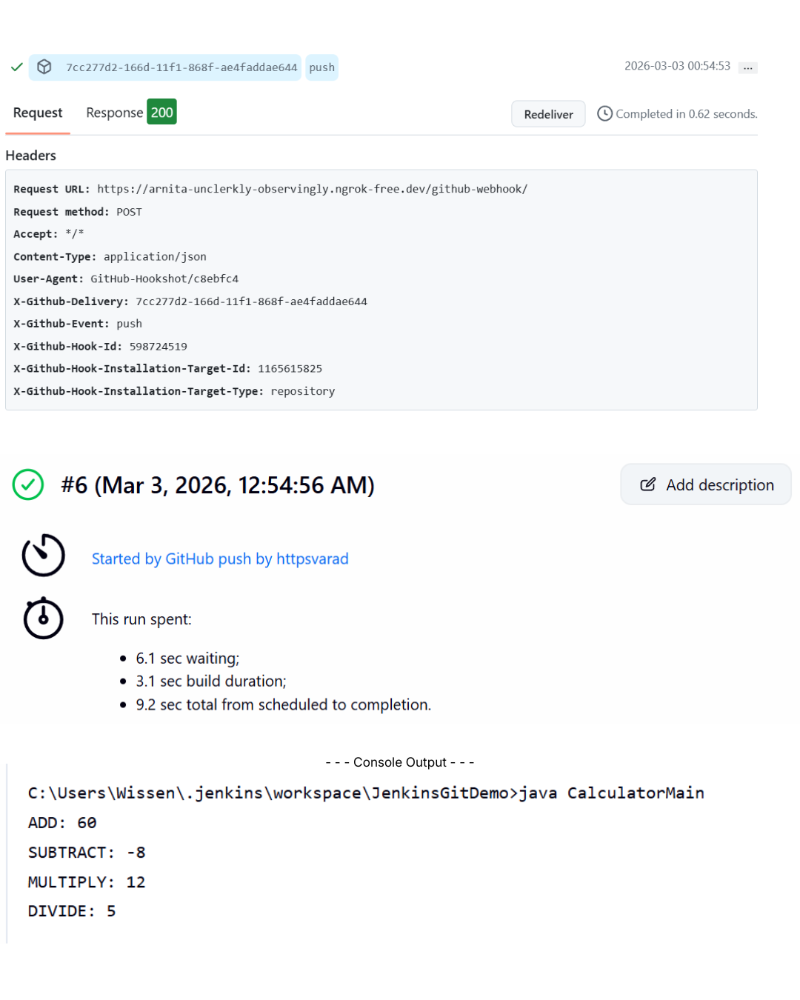

# Jenkins GitHub Auto-Build Setup

Assignment :

```bash
Calculator.java
-------------------
add()
sub()
mul()
div()
 
CalculatorMain.java
--------------------------
main()
 
* Both of these programs should be pushed into GIT/GitHub.
* As soon as the code is pushed to GIT/GitHub, immediately take the code, compile, test, build and execute.
```
---

## 1️⃣ Prerequisites

* Jenkins installed (or `jenkins.war` running with `java -jar jenkins.war`)
* GitHub repository ready
* ngrok installed (for exposing local Jenkins to the internet)
* Jenkins plugins installed:

  * **Git Plugin**
  * **GitHub Integration Plugin**

---

## 2️⃣ Start Jenkins

```bash
java -jar jenkins.war
```

* Jenkins runs by default on **port 8080**
* Access it at [http://localhost:8080](http://localhost:8080)

---

## 3️⃣ Expose Jenkins with ngrok

1. Open a new terminal and run:

```bash
ngrok http 8080
```

2. Copy the **Forwarding URL** from ngrok (e.g., `https://abcd1234.ngrok.io`)
3. This URL will be used for GitHub webhook configuration

---

## 4️⃣ Create Jenkins Job

1. Jenkins → **New Item → Freestyle Project**
2. Configure **Source Code Management → Git → Repository URL**
3. Add build steps (e.g., shell script, build commands)
4. **Enable build trigger**:

   * Freestyle: Check **GitHub hook trigger for GITScm polling**

---

## 5️⃣ Configure GitHub Webhook

1. Go to your GitHub repo → **Settings → Webhooks → Add webhook**
2. Payload URL:

```
https://<ngrok-public-url>/github-webhook/
```
3. Content type: `application/json`
4. Choose **Just the push event**
5. Save webhook

---

## 6️⃣ Test the Setup

1. Push a commit to your GitHub repository.
2. Jenkins should automatically start a build.
3. Check **Jenkins → Job → Build History**
4. GitHub webhook logs: **Settings → Webhooks → Recent Deliveries**

---

## 7️⃣ Console Output


